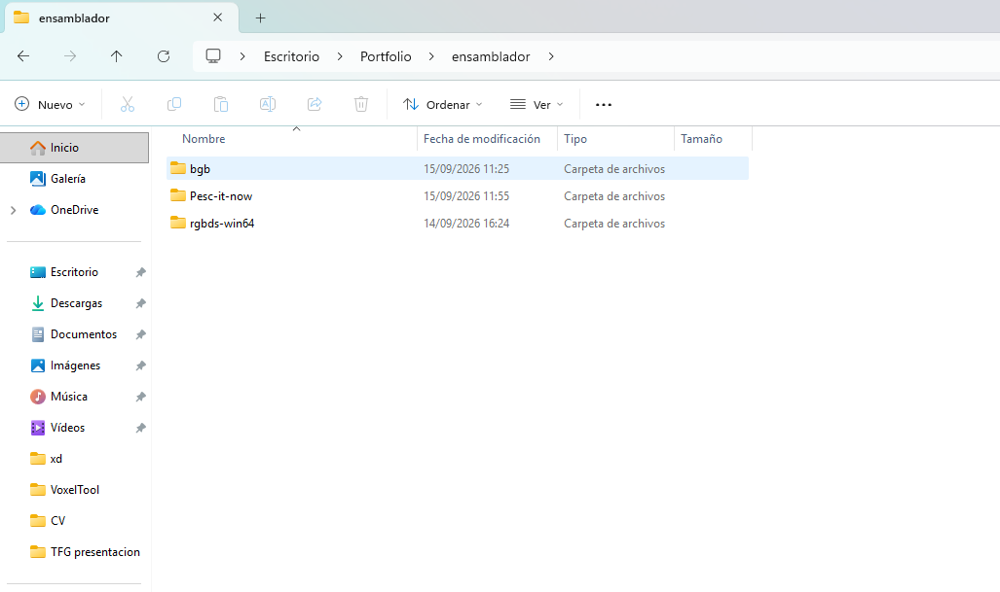
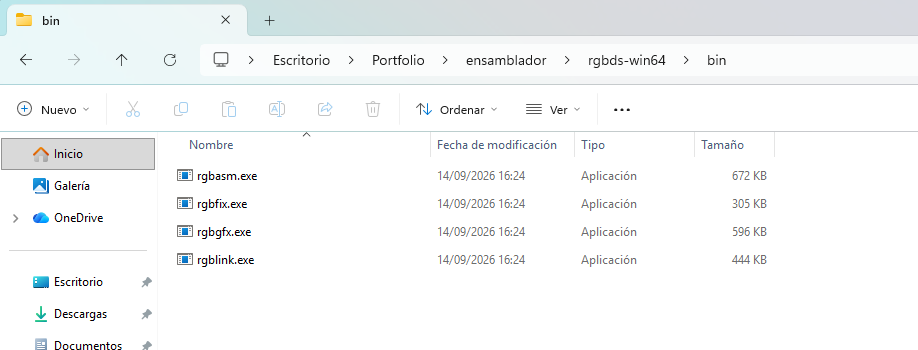

# Pesc-it-now


# Vamos a instalarlo

## Estructura del Entorno

Para que la configuración funcione correctamente, vamos a  organizar una carpeta principal (por ejemplo, `ensamblador`) que contenga:

* `bgb/` - Carpeta con el emulador BGB.
* `rgbds/` - Carpeta con los ejecutables de RGBDS (`rgbasm.exe`, `rgblink.exe`, etc.).
* `[nombre_del_repo]/` - La carpeta de este repositorio.



## 1. Configuración de Variables de Entorno (Windows)

Para poder compilar el juego, tu sistema debe reconocer los comandos de RGBDS desde cualquier terminal.

1. Abre una terminal (CMD o PowerShell).
2. Pon el siguiente comando, sustituyendo `<rgbds_path>` por la ruta completa hacia tu carpeta de RGBDS (donde se encuentran `rgbasm.exe` y el resto de herramientas):

   ```cmd
   setx PATH "%PATH%;<rgbds_path>"
   ```
   *(Ejemplo: `setx PATH "%PATH%;C:\Users\tu_usuario\Desktop\ensamblador\rgbds"`)*



3. **Cierra la terminal** por completo para que los cambios tengan efecto.
4. Abre una terminal nueva y verifica la instalación escribiendo:

   ```cmd
   rgbasm -V
   ```
   Si la consola devuelve el número de versión, la configuración ta joya.

## 2. Configuración del Editor de Código

El proyecto está preparado para **Visual Studio Code**.

1. Abre la carpeta de este repositorio en VS Code.
2. Ve a las extensiones e instala **[RGBDS Z80](https://marketplace.visualstudio.com/items?itemName=donaldhays.rgbds-z80)**.

## 3. Compilación y Ejecución

Una vez que el entorno de desarrollo y el editor estén listos:

1. Abre una terminal dentro de la raíz de este repositorio (puedes usar la terminal de VS Code).
2. Ejecuta el script de compilación:

   ```cmd
   ./build.bat
   ```
3. Si la compilación es correcta, se generará el archivo ejecutable `.gb` dentro de la carpeta `build/`.
4. Abre ese archivo `.gb` utilizando el emulador **BGB** para probar el juego.
